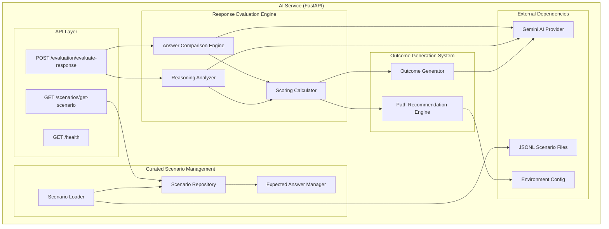
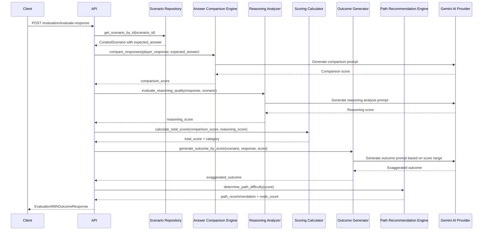
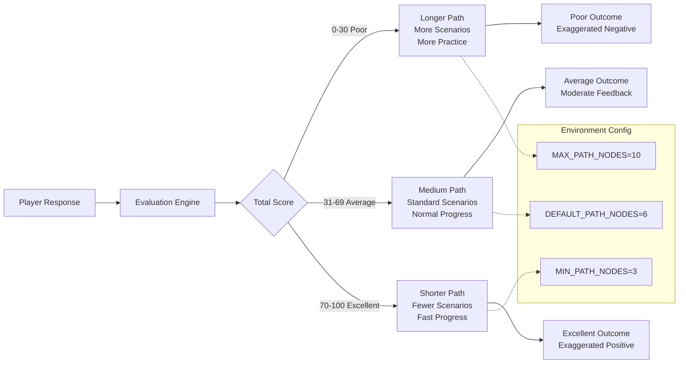

# AI Service Enhancement Design

## Overview

This design transforms the existing AI service to focus exclusively on response evaluation, scoring, and outcome generation using curated scenarios. The service will evaluate player responses against expected answers, generate scores based on reasoning quality, and provide exaggerated outcomes that determine path difficulty in the game.

## Architecture

### New Architecture Focus

The AI service architecture will be restructured with the following components:



### Data Flow



### Score-Based Path Logic



### Component Integration

- **Scenario Repository**: Manages the curated set of 500 scenarios with expected answers and reasoning
- **Answer Comparison Engine**: Evaluates player responses against expected optimal answers
- **Reasoning Analyzer**: Analyzes the quality of reasoning in player responses
- **Path Recommendation Engine**: Determines path difficulty based on scoring performance
- **Outcome Generator**: Creates dramatically positive, negative, or moderate outcomes based on score ranges

## Components and Interfaces

### 1. Curated Scenario Management Service

#### ScenarioRepository
```python
class ScenarioRepository:
    async def load_scenarios_from_file(file_path: str) -> List[CuratedScenario]
    async def get_scenario_by_id(scenario_id: str) -> Optional[CuratedScenario]
    async def get_random_scenario(theme: Optional[Theme] = None) -> CuratedScenario
    async def get_scenarios_by_theme(theme: Theme) -> List[CuratedScenario]
```

#### ExpectedAnswerManager
```python
class ExpectedAnswerManager:
    async def get_expected_answer(scenario_id: str) -> ExpectedAnswer
    async def get_reasoning_criteria(scenario_id: str) -> List[str]
    async def validate_answer_format(answer: ExpectedAnswer) -> bool
```

#### ScenarioLoader
```python
class ScenarioLoader:
    async def initialize_scenario_database() -> bool
    async def reload_scenarios() -> int
    async def validate_scenario_integrity() -> Dict[str, Any]
```

### 2. Response Evaluation Engine

#### AnswerComparisonEngine
```python
class AnswerComparisonEngine:
    async def compare_responses(player_response: str, expected_answer: str) -> float
    async def analyze_solution_approach(player_response: str, expected_reasoning: List[str]) -> float
    async def calculate_similarity_score(response1: str, response2: str) -> float
```

#### ReasoningAnalyzer
```python
class ReasoningAnalyzer:
    async def evaluate_reasoning_quality(response: str, scenario: str) -> float
    async def identify_reasoning_patterns(response: str) -> List[str]
    async def score_logical_coherence(response: str) -> float
```

#### ScoringCalculator
```python
class ScoringCalculator:
    async def calculate_total_score(comparison_score: float, reasoning_score: float) -> float
    async def determine_score_category(total_score: float) -> str  # "poor", "average", "excellent"
    async def generate_detailed_feedback(scores: Dict[str, float]) -> str
```

### 3. Outcome Generation System

#### OutcomeGenerator
```python
class OutcomeGenerator:
    async def generate_outcome_by_score(scenario: str, response: str, score: float) -> str
    async def create_excellent_outcome(scenario: str, response: str) -> str  # 70-100
    async def create_poor_outcome(scenario: str, response: str) -> str      # 0-30
    async def create_average_outcome(scenario: str, response: str) -> str   # 31-69
```

#### PathRecommendationEngine
```python
class PathRecommendationEngine:
    async def determine_path_difficulty(score: float) -> str  # "shorter", "medium", "longer"
    async def calculate_node_count(path_difficulty: str) -> int
    async def get_path_configuration() -> Dict[str, int]  # min/max nodes from env
```

### 4. Enhanced API Endpoints

#### Scenario Retrieval Endpoint
```python
@app.get("/scenarios/get-scenario")
async def get_curated_scenario(theme: Optional[str] = None) -> CuratedScenarioResponse
```

#### Enhanced Evaluation Endpoint
```python
@app.post("/evaluation/evaluate-response")
async def evaluate_response_with_outcome(request: ResponseEvaluationRequest) -> EvaluationWithOutcomeResponse
```

## Data Models

### New Data Models

#### CuratedScenario
```python
class CuratedScenario(BaseModel):
    scenario_id: str
    content: str
    theme: Theme
    difficulty: DifficultyLevel
    expected_answer: str
    reasoning_criteria: List[str]
    created_at: datetime
```

#### ExpectedAnswer
```python
class ExpectedAnswer(BaseModel):
    answer_text: str
    reasoning_points: List[str]
    key_concepts: List[str]
    scoring_weight: float
```

#### ResponseEvaluationRequest
```python
class ResponseEvaluationRequest(BaseModel):
    scenario_id: str
    player_response: str
    session_id: Optional[str] = None
    context: Optional[Dict[str, Any]] = None
```

#### EvaluationWithOutcomeResponse
```python
class EvaluationWithOutcomeResponse(BaseModel):
    response_id: str
    total_score: float
    comparison_score: float
    reasoning_score: float
    score_category: str  # "poor", "average", "excellent"
    exaggerated_outcome: str
    path_recommendation: str  # "shorter", "medium", "longer"
    recommended_node_count: int
    detailed_feedback: str
    processing_time_ms: float
```

#### CuratedScenarioResponse
```python
class CuratedScenarioResponse(BaseModel):
    scenario_id: str
    content: str
    theme: Theme
    difficulty: DifficultyLevel
    context: Optional[Dict[str, Any]] = None
```

### Enhanced Existing Models

#### Enhanced ScoringResult
- Add `comparison_score: float` field
- Add `reasoning_score: float` field  
- Add `score_category: str` field
- Add `exaggerated_outcome: str` field
- Add `path_recommendation: str` field
- Add `recommended_node_count: int` field

## Error Handling

### Scenario Loading Error Handling

1. **File Loading Failure**: Fallback to backup scenario file or default scenarios
2. **Scenario Validation Failure**: Log invalid scenarios and continue with valid ones
3. **Missing Expected Answers**: Use default scoring criteria for scenarios without expected answers
4. **Database Connection Failure**: Use in-memory scenario storage as fallback

### Response Evaluation Error Handling

1. **Scoring Failure**: Return default scores with appropriate error logging
2. **Outcome Generation Failure**: Provide generic positive/negative outcomes based on score
3. **Exaggeration Engine Failure**: Return non-exaggerated outcomes with warning
4. **Timeout Handling**: Implement 30-second timeout with graceful degradation

## Testing Strategy

### Unit Testing

1. **Scenario Uniqueness Testing**
   - Test uniqueness validation across different scenarios
   - Test session-based scenario tracking
   - Test similarity scoring algorithms

2. **Outcome Generation Testing**
   - Test positive outcome generation for high scores (>50)
   - Test negative outcome generation for low scores (≤50)
   - Test appropriateness validation
   - Test exaggeration amplification

3. **Integration Testing**
   - Test end-to-end scenario generation with uniqueness
   - Test complete evaluation flow with exaggerated outcomes
   - Test fallback mechanisms for AI provider failures

### Performance Testing

1. **Load Testing**
   - Test concurrent scenario generation requests
   - Test response evaluation under high load
   - Measure response times for uniqueness validation

2. **Memory Testing**
   - Test scenario history storage efficiency
   - Monitor memory usage during long sessions
   - Test cleanup of expired session data

### Functional Testing

1. **Scenario Quality Testing**
   - Validate scenario appropriateness across themes
   - Test difficulty level compliance
   - Verify uniqueness across multiple generations

2. **Outcome Quality Testing**
   - Validate outcome entertainment value
   - Test logical connection between scenarios and outcomes
   - Verify appropriateness of exaggerated content

## Implementation Approach

### Phase 1: Core Enhancement
1. Implement ScenarioUniquenessTracker with Redis backend
2. Enhance existing scenario generation with uniqueness validation
3. Create OutcomeGenerator with basic positive/negative outcome logic

### Phase 2: Advanced Features
1. Implement ContentVariationEngine for improved scenario diversity
2. Add ExaggerationEngine for dramatic outcome amplification
3. Enhance API endpoints with new request/response models

### Phase 3: Monitoring & Optimization
1. Add comprehensive performance monitoring
2. Implement advanced analytics for scenario and evaluation quality
3. Optimize uniqueness algorithms based on usage patterns

### Configuration Management

#### Environment Variables
```
# Scenario Management
CURATED_SCENARIOS_FILE_PATH=/data/scenarios.jsonl
SCENARIO_BACKUP_FILE_PATH=/data/scenarios_backup.jsonl
SCENARIO_RELOAD_INTERVAL=3600

# Scoring Thresholds
SCORE_THRESHOLD_POOR_MAX=30
SCORE_THRESHOLD_EXCELLENT_MIN=70
COMPARISON_WEIGHT=0.6
REASONING_WEIGHT=0.4

# Path Configuration
MIN_PATH_NODES=3
MAX_PATH_NODES=10
DEFAULT_PATH_NODES=6

# Outcome Generation
OUTCOME_EXAGGERATION_LEVEL=high
OUTCOME_APPROPRIATENESS_CHECK=true

# Performance
EVALUATION_TIMEOUT_SECONDS=5
MAX_CONCURRENT_EVALUATIONS=20
CACHE_SCENARIOS_IN_MEMORY=true
```

This design transforms the AI service to focus exclusively on evaluation and outcome generation while working with curated scenarios, providing the path difficulty management requested.