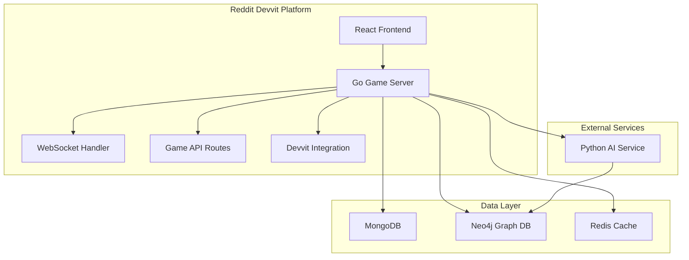

# DumDoors Game Design Document

## Overview

DumDoors transforms the existing dumdoors Devvit template into a multiplayer AI decision game. The system leverages the existing React frontend while replacing the Express backend with a comprehensive Go server that handles all game logic, WebSocket connections, and API routes. The architecture supports real-time multiplayer gameplay and uses a hybrid database approach with MongoDB for game data and Neo4j for path relationships.

## Architecture

### High-Level Architecture



### Service Communication Flow

1. **Frontend → Go Server**: Game actions and UI state management via REST API
2. **Go Server → AI Service**: Door generation and response scoring
3. **Go Server → Databases**: Data persistence and path calculations
4. **WebSocket Connections**: Real-time updates between all connected players
5. **Devvit Integration**: Reddit authentication and platform-specific features

## Components and Interfaces

### Frontend Components (React + TypeScript)

#### Core Game Components
- **GameLobby**: Session creation, player joining, mode selection
- **GameBoard**: Main game interface showing current door and player responses
- **PlayerStatus**: Real-time display of player positions and scores
- **ResponseInput**: Text input component for player solutions (500 char limit)
- **Leaderboard**: Rankings and performance statistics
- **GameResults**: End-game summary and statistics

#### Hooks and State Management
- **useGameSession**: WebSocket connection and game state management
- **usePlayerProgress**: Individual player progress tracking
- **useRealTimeUpdates**: Live updates for multiplayer synchronization

### Backend Services

#### Go Game Server (Replaces Express)
```go
// HTTP Routes
type GameRoutes struct {
    CreateSession    // POST /api/game/create
    JoinSession      // POST /api/game/join/:sessionId  
    SubmitResponse   // POST /api/game/submit-response
    GetGameStatus    // GET /api/game/status/:sessionId
    GetLeaderboard   // GET /api/leaderboard
    InitGame         // GET /api/init (Devvit integration)
}

// WebSocket Events
type WebSocketEvents struct {
    PlayerJoined     // game:player-joined
    DoorPresented    // game:door-presented
    ResponseSubmitted // game:response-submitted
    ScoresUpdated    // game:scores-updated
    GameCompleted    // game:game-completed
}

// Core Services
type GameService interface {
    CreateSession(mode GameMode, creatorID string) (*GameSession, error)
    JoinSession(sessionID, playerID string) error
    StartGame(sessionID string) error
    SubmitResponse(sessionID, playerID, response string) error
    GetNextDoor(playerID string, currentScore int) (*Door, error)
    CalculatePlayerPath(playerID string, scores []int) (*PlayerPath, error)
}

type WebSocketManager interface {
    BroadcastToSession(sessionID string, event Event) error
    SendToPlayer(playerID string, event Event) error
    HandlePlayerDisconnect(playerID string) error
    RestorePlayerConnection(playerID string) error
}

type DevvitIntegration interface {
    GetCurrentUser() (*RedditUser, error)
    GetPostContext() (*PostContext, error)
    StoreGameState(postID string, state GameState) error
    LoadGameState(postID string) (*GameState, error)
}
```

#### Python AI Service (New Microservice)
```python
class AIService:
    async def generate_door(self, theme: str, difficulty: int) -> Door
    async def score_response(self, door: Door, response: str) -> ScoringResult
    async def get_themed_doors(self, theme: str, count: int) -> List[Door]
    async def analyze_response_creativity(self, response: str) -> CreativityMetrics
```

## Data Models

### MongoDB Collections

#### Game Sessions
```typescript
interface GameSession {
  _id: ObjectId
  sessionId: string
  mode: 'multiplayer' | 'single-player'
  theme?: string
  players: PlayerInfo[]
  status: 'waiting' | 'active' | 'completed'
  currentDoor?: Door
  createdAt: Date
  startedAt?: Date
  completedAt?: Date
}

interface PlayerInfo {
  playerId: string
  username: string
  redditUserId: string
  joinedAt: Date
  currentPosition: number
  totalScore: number
  responses: PlayerResponse[]
  isActive: boolean
}
```

#### Doors and Responses
```typescript
interface Door {
  _id: ObjectId
  doorId: string
  content: string
  theme: string
  difficulty: number
  expectedSolutionTypes: string[]
  createdAt: Date
}

interface PlayerResponse {
  responseId: string
  doorId: string
  playerId: string
  content: string
  aiScore: number
  submittedAt: Date
  scoringMetrics: {
    creativity: number
    feasibility: number
    humor: number
    originality: number
  }
}
```

### Neo4j Graph Structure

#### Path Relationships
```cypher
// Nodes
(:Door {id, content, difficulty, theme})
(:Player {id, username, currentPosition})
(:Path {id, totalDoors, difficulty})

// Relationships
(:Door)-[:LEADS_TO {scoreThreshold}]->(:Door)
(:Player)-[:CURRENTLY_AT]->(:Door)
(:Player)-[:FOLLOWING]->(:Path)
(:Path)-[:CONTAINS]->(:Door)
```

## Error Handling

### Client-Side Error Handling
- **Network Failures**: Automatic retry with exponential backoff
- **WebSocket Disconnections**: Reconnection attempts with state restoration
- **Invalid Input**: Real-time validation with user feedback
- **Session Timeouts**: Graceful handling with rejoin options

### Server-Side Error Handling
- **AI Service Unavailable**: Fallback to cached doors and basic scoring
- **Database Connection Issues**: Circuit breaker pattern with Redis fallback
- **Player Disconnections**: State preservation for 5-minute reconnection window
- **Concurrent Access**: Optimistic locking for game state updates

### Monitoring and Logging
- **Performance Metrics**: Response times, concurrent users, error rates
- **Game Analytics**: Player behavior, door difficulty effectiveness, completion rates
- **System Health**: Database connections, service availability, memory usage

## Testing Strategy

### Unit Testing
- **Frontend Components**: React Testing Library for UI interactions
- **Backend Services**: Go testing framework for game logic
- **AI Service**: Python pytest for scoring algorithms
- **Database Operations**: Mock databases for data layer testing

### Integration Testing
- **API Endpoints**: Full request/response cycle testing
- **WebSocket Communication**: Real-time event flow validation
- **Cross-Service Communication**: End-to-end service interaction tests
- **Database Consistency**: Multi-database transaction testing

### Performance Testing
- **Load Testing**: Simulate 50 concurrent game sessions
- **Stress Testing**: Maximum player capacity per session
- **WebSocket Performance**: Real-time update latency under load
- **Database Performance**: Query optimization and indexing validation

### User Acceptance Testing
- **Gameplay Flow**: Complete game session from start to finish
- **Multiplayer Synchronization**: Multiple players in same session
- **AI Scoring Accuracy**: Response evaluation consistency
- **Mobile Responsiveness**: Touch interface and responsive design

## Security Considerations

### Authentication and Authorization
- **Reddit OAuth Integration**: Leverage existing Devvit authentication
- **Session Management**: Secure session tokens with expiration
- **Rate Limiting**: Prevent spam responses and API abuse
- **Input Validation**: Sanitize all user inputs and responses

### Data Protection
- **Personal Information**: Minimal data collection, Reddit username only
- **Response Privacy**: Player responses visible only within game session
- **Database Security**: Encrypted connections and access controls
- **API Security**: HTTPS enforcement and request validation

## Deployment and Scalability

### Containerization Strategy
- **Frontend**: Existing Devvit deployment process
- **Go Backend**: Docker container with health checks
- **AI Service**: Python container with GPU support options
- **Databases**: Managed cloud services (MongoDB Atlas, Neo4j Aura)

### Scaling Considerations
- **Horizontal Scaling**: Load balancer for Go backend instances
- **Database Sharding**: MongoDB sharding by game session
- **Caching Strategy**: Redis for frequently accessed doors and scores
- **CDN Integration**: Static assets and door content delivery

### Monitoring and Observability
- **Application Metrics**: Custom dashboards for game performance
- **Error Tracking**: Centralized logging and error reporting
- **Performance Monitoring**: Real-time system health indicators
- **User Analytics**: Game engagement and retention metrics